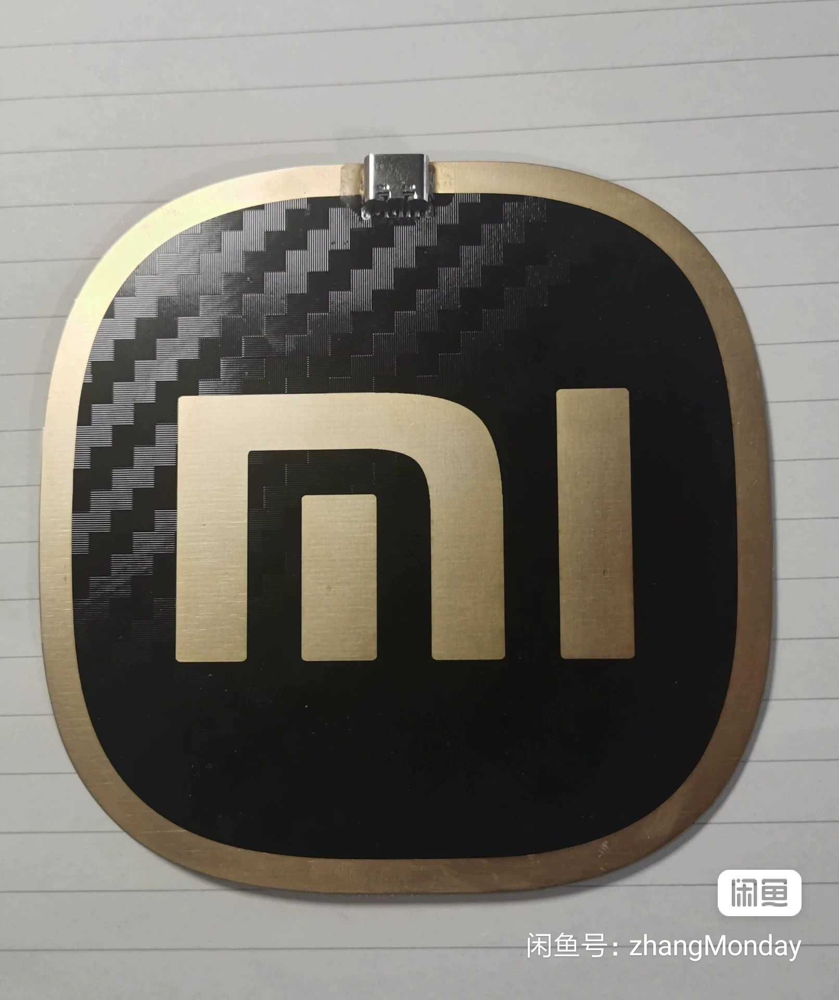

# SU7Ultra-logos-PCB-Heatingsheet

**小米SU7Ultra黄金车标外形的PCB发热板 --- 为发烧而生！**

## 项目介绍

画着玩的电路板，外观模仿小米SU7Ultra车标，完美还原200万圆角和碳纤维纹路，内层隐藏发热电路。  
[项目介绍视频（B站）](https://www.bilibili.com/video/BV1rzVGzHELW/)

本项目开源PCB的Gerber生产稿（由立创EDA导出）。

## 图片展示

|  |  |
| :-----------------: | :-----------------: |
|  |  |

## 使用说明

通电即开始发热，使用Type-C接口，手机充电头即可供电。
5V供电下理论能加热到40度左右，实际温度会因使用环境有所差异。
升高电压可提升温度。若感觉过热，请及时断电。

## 规格参数

- **尺寸**：10×10cm
- **厚度**：1.6mm
- **功率**：10W

## 生产工艺要求（重要，必读）

请严格按照以下工艺生产：

- **板材**：FR-4
- **长宽**：10×10cm
- **层数**：4
- **阻焊颜色**：**亮黑色**（否则无法显示碳纤维纹路）
- **厚度**：推荐1.6mm
- **内层铜厚**：**1oz**（默认0.5oz会使发热效果减半）
- **喷镀**：沉金
- **（可选）**：不加生产编号

## 焊接组装

PCB到手后，焊接一个6P的Type-C母座即可使用。

## 免费打样说明

- 本板工艺**不支持任何板厂免费打样**。
- **嘉立创**：不支持亮黑色阻焊，内层铜厚不支持1oz，不支持此沉金面积。
- **捷配**：因外层线路过密影响产线无法通过审核。
  
  
  
  若下单时提示拆单嫌疑，可使用此工具绕过：[JLC-no-chaidan](https://github.com/zhangMonday/JLC-no-chaidan)

## 关于成品

如果你不想自己下单或焊接，可关注我的闲鱼号：**zhangMonday**，不定期9.9出成品。

## 关于开源协议

本项目采用 [CC BY-NC](https://creativecommons.org/licenses/by-nc/4.0/) 开源协议：  
- 您**不可倒卖**此开源文件。  
- 您**可出售成品**，但需注明开源出处。

如果你觉得本项目还有点意思，请点个Star~ ⭐
